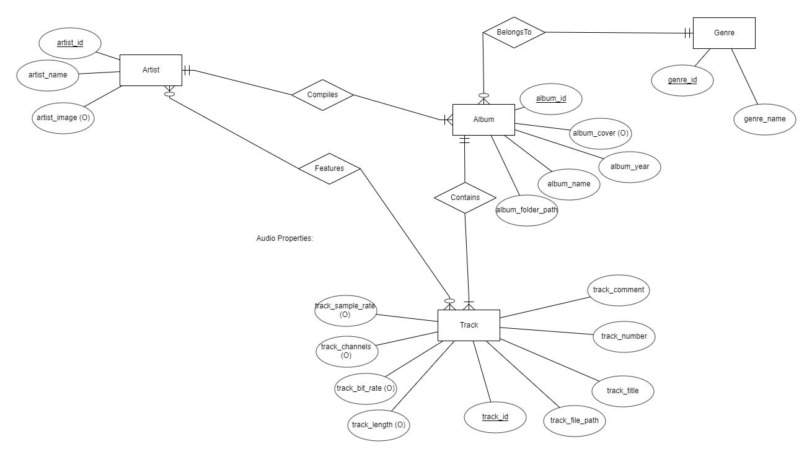

# AMP
A Music Player - simple server for playing music on a device, controlled using client applications.

# API
The server uses gRPC as the RPC protocol for accessing server data and adding music folders etc.
Protobuf files can be found in ```grpc/protos``` folder. C++ and C# files have already been generated but one can easily compile protobuf files for other languages using ```protoc``` compiler and provided plugins.

# Clients
In the ```clients/``` directory there are a few client examples:

- ampcli - planned for implementation, .NET Core CLI client for the srver
- AMPClient-UWP - UWP WinUI 3.0 client - currently in development

Android app is also planned for addition.

# Dependencies

Project uses [vcpkg](https://github.com/microsoft/vcpkg) as the library manager. Libraries needed to build the project are:

- [grpc/grpc](https://github.com/grpc/grpc) - used for server RPC API
- [nlohmann/json](https://github.com/nlohmann/json) - C++ json library
- [taglib/taglib](https://github.com/taglib/taglib) - may be replaced later, used for audio metadata reading
- [FFmpeg/FFmpeg](https://github.com/FFmpeg/FFmpeg) - used for reading and decoding audio / video files
- [jtv/libpqxx](https://github.com/jtv/libpqxx) - C++ postgresql client library
- [mackron/miniaudio](https://github.com/mackron/miniaudio) - used for audio playback

As for the system requirements, there should exist a postgresql server which can be used for the database. The server uses the ```AMP``` database and the user named ```amp_admin``` with the same password.

# Database design

Database uses the following ER model:


ER model is open to changes (for example adding more metadata for the track, more artist data, more tables and relationships etc). The server is built with a plan that each of the database fields can be retrieved through some gRPC service.
